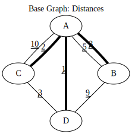
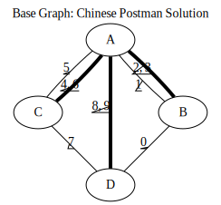

[](http://travis-ci.org/brooksandrew/postman_problems)

[](https://coveralls.io/github/brooksandrew/postman_problems?branch=master)


## Postman Problems:

[Contents](#contents)  
[Install](#install)  
[Usage](#usage)  
[Examples](#examples)  
[Developers](#developers)  
[License](#license)

## Contents

This package contains implementations to solve the suite of [Postman Problems] from graph theory.


Currently this is a suite of one: The Chinese Postman Problem, the most straightforward of the Postman Problems. 
Plans are to implement the Rural Postman Problem next.

## Install

### Basic

Install the `postman_problems` package:

1. Clone the repo.  For now, just grab the master branch from GitHub.  When I release to PyPI, I'll make proper 0.1 release.
    ```
    git clone https://github.com/brooksandrew/postman_problems.git
    cd postman_problems
    ```

2. Install with pip.  Builds are tested on Python 2.7, 3.3, 3.4, 3.5, 3.6.  
    ```
    pip install .
    ```

### Viz 

`postman_problems` leverages [Graphviz] for visualization which unlocks more robust visualizations than just networkx and 
matplotlib.  However, this also comes with several dependencies.  These are managed separately from the 
base package, so users can optimize graphs to their heart's content unencumbered from the weight and hassle of 
installing viz dependencies, if they so choose.

1. Install optional Python visualization libraries.
    ```
    pip install .[viz]
    ```

2. Install Graphviz.  You need this underlying software application in addition to the [graphviz python package] which
   wraps around it.  Checkout the [Graphviz Download page] for the best way to install on your OS.
  
    For Mac, this should be as easy as:
    ```
    brew install graphviz
    ```
    
    For Linux, 
    ```
    sudo apt-get install graphviz
    ```
    
    These are the installs I'm currently using on my builds for the [tests on TravisCI].  YMMV.  For Windows users and 
    for those where these methods fail, I defer to the Graphviz download docs.
    

## Usage

### 1. CLI

The easiest way to start is with the command line installed with this package, `chinese_postman`.  

There are several optional command line arguments, but the only one required is `--edgelist`.  For the complete list of
optional arguments run:

```
chinese_postman --help
```

The big ones are `--viz_static` and `--viz_animation` which when present will create the static (single) and animation 
of the CPP solution.  Most of the other arguments control the visualizations with default values.  
  
Below we solve the CPP on the [Seven Bridges of Konigsberg] network.  The edgelist is provided in this repo, but you
can swap this out for any comma delimited text file where the first two columns represent the node pairs in your network.
The columns should have headers.  Columns after the first two are treated as edge attributes.

```bash
chinese_postman --edgelist postman_problems/examples/seven_bridges/edgelist_seven_bridges.csv
```

If the `chinese_postman` entry point is not working for whatever reason, you can run the script directly with:

```
python postman_problems/chinese_postman.py --edgelist postman_problems/examples/seven_bridges/edgelist_seven_bridges.csv
```
 
You should see output that describes the CPP solution (Eulerian circuit) through each edge.  Something like this:

```
('A', 'C', {'trail': 'c', 'distance': 2, 'id': 2})
('C', 'D', {'trail': 'g', 'distance': 3, 'id': 6})
('D', 'C', {'trail': 'g', 'distance': 3, 'id': 6, 'augmented': True})
('C', 'A', {'trail': 'd', 'distance': 10, 'id': 3})
('A', 'D', {'trail': 'e', 'distance': 1, 'id': 4})
('D', 'B', {'trail': 'f', 'distance': 9, 'id': 5})
('B', 'A', {'trail': 'a', 'distance': 3, 'id': 0})
('A', 'B', {'trail': 'b', 'distance': 5, 'id': 1})
('B', 'A', {'trail': 'a', 'distance': 3, 'id': 0, 'augmented': True})
```

The first two values of each tuple are the "from" and the "to" node respectively for each edge in the circuit.  

The third value contains the edge attributes for each edge walked.  These are mostly grabbed from the starting graph, 
with two exceptions:
  - `augmented ` is added to edges after their first walk (double backing... the thing we want to minimize)
  - `id` is generated to aid computation in the case of parallel edges.  This can generally be ignored.
 
 
### 2. Python

The postman solvers are modules that can also be imported and run within a Python environment.  This might interest you 
if solving the CPP is just one step in your problem, you'd like to poke and prod at the output, or you'd like to tweak 
the visualization or optimization parameters beyond what's provided from the CLI.

The snippet below should produce exactly the same output as printed above in [CLI](#1.-cli).

```python
from postman_problems.graph import cpp

# find CPP solution
circuit, graph = cpp(edgelist_filename='postman_problems/examples/seven_bridges/edgelist_seven_bridges.csv',
                     start_node='D')

# print solution
for e in circuit:
    print(e)
```

## Examples

Two examples are included in `postman_problems` which demonstrate end-to-end usage: raw edgelist & nodelist => 
optimization and visualization.
  
Both examples are added as entry points and pre-configured arguments, so they can be executed with the single commands below.
 
Note, the visualization step will write a GIF and a series of PNGs to your filesystem.  The paths are locked into the 
  *postman_problems/examples/[example_name]/output/*, so they should not be capable of writing rogue files on your 
  machine.
  
An expected exception will be thrown if you don't have the visualization dependencies.  But no worries, 
the output is prepackaged into `/examples` and embedded below.  

Files produced:
 - `cpp_graph`: representation of `cpp_graph.svg` in the [DOT] graph description language.  This is provided mostly for 
 reference, or for tweaking.
 - `cpp_graph.svg`: static image with edge attributes annotating the walk sequence.
 - `cpp_graph.gif`: animation highlighting each edge in the Euler circuit (CPP solution) as it's walked.
 - `png/img*.png`: PNGs generated for each frame of the GIF (omitted from package, but will hit your filesystem when you 
 run the examples).
 

### 1. Seven Bridges of Konigsberg

The Seven Bridges of Konigsberg is rather simple network with just 4 nodes and 7 edges.  Although small, it does contain
 2 parallel edges which introduce some complexity to the CPP computation.
 
 This was the graph with which Leonhard Euler famously postulated in 1736 that there exists a path which visits 
each edge exactly once if all nodes have even degree. Although this wasn't proven until the 1870s by Carl Hierholzer,
Euler was right and this property is a key part of solving the Postman Problems. 

This contrived example has been bundled and parameterized into a script that can be run with: 
```
chinese_postman_seven_bridges
```

The example can also be run using the verbose method below which allows you to more easily parameterize more pieces.  
Many of the options provided below are defaults and can be excluded in practice. They are included here simply to convey 
what the possibilities are.
```
chinese_postman --edgelist postman_problems/examples/seven_bridges/edgelist_seven_bridges.csv \
--viz_static \
--viz_static_filename 'postman_problems/examples/seven_bridges/output/cpp_graph' \
--viz_static_engine 'dot' \
--viz_static_format 'svg' \
--viz_animation \
--viz_animation_filename 'postman_problems/examples/seven_bridges/output/cpp_graph.gif' \
--viz_images_dir 'postman_problems/examples/seven_bridges/output/img' \
--viz_animation_engine 'dot' \
--viz_animation_format 'png' \
--fps 2
```

`base_cpp_graph.svg`: This is the starting graph.  Edges are annotated by distance.  



`cpp_graph.svg`: Edges are annotated with the order in which they are walked, starting at 0.  Edges walked more than 
once are annotated by a sequence of numbers (walk order) and **bolded**.



`cpp_graph.gif`: The nodes and edges in red indicate the current direction.  
 


`cpp_graph`: dot representation of the graph is also provided.  This is mostly for reference, but in rare cases you may 
want to tweak graphviz parameters directly here.


### 2. Sleeping Giant

This example is near and dear to my heart and the motivation for this project in the first place.  
  
[Sleeping Giant] is a state park near my hometown in Hamden CT with a little challenge called the [Giant Master Program]. 
 Those who hike every trail (see [trail map]) are awarded the honor of Giantmaster Marathoner and earn themselves a spot 
 on the [Giantmaster roster] and the glory of a red highlight on their name.
  
That's all I'll say here.  I wrote more about the personal motivation and Sleeping Giant specific data/problem in a 
[DataCamp tutorial] which also helped motivate this project.


```
chinese_postman_sleeping_giant
```

`postman_problems/examples/sleeping_giant/cpp_graph.svg`:


`postman_problems/examples/sleeping_giant/cpp_graph.gif` (omitted from package due to size):  Can be viewed
 [here](https://gist.github.com/brooksandrew/1f3a2ce56a3ac0ea0ac2213bccb57e99/08d063791540ef66d1de03603dec77fb2d32ab21).

## Developers

If you'd like to fork or contribute directly to this project (PRs welcome), or simply want run the tests, here's how:
 
 1. Install test dependencies.
 
    ```
    pip install .[test]
    pip install .[viz]
    ```
 
    Or do an editable install from the beginning.  This is my typical approach when developing.
    
    ```
    pip install -e .
    pip install -e .[viz]
    pip install -e .[test]
    ```    

 
 
 2. <a href="http://www.troll.me?p=50341"></a>
    
    ```
    python -m pytest
    pytest --cov
    ```
    
    Some tests that take quite a while to run.  Namely the examples that write visualizations to the filesystem for 
    large networks.  
    
    As I have limited patience while developing, but am too cautious to drop them completely, I've 
    kept and marked them with the `@slow` and `@long` decorators.  `conftest.py` is configured to exclude them by 
    default with a simple run of `pytest` or `python -m pytest`, but the full test suite can be run by:
    
    ```
    python -m pytest --runslow
    pytest --cov --runslow
    ```
    

## License

Released under the MIT License (see LICENSE).

Copyright (C) 2017 Andrew Brooks.


 
 
[Postman Problems]: https://en.wikipedia.org/wiki/Route_inspection_problem
[Seven Bridges of Konigsberg]:https://en.wikipedia.org/wiki/Seven_Bridges_of_K%C3%B6nigsberg
[Graphviz python package]: https://pypi.python.org/pypi/graphviz
[Graphviz Download page]:http://www.graphviz.org/Download..php
[Graphviz]:http://www.graphviz.org/
[Tests on TravisCI]: https://github.com/brooksandrew/postman_problems/blob/master/.travis.yml
[Sleeping Giant]:http://www.sgpa.org/
[Giant Master Program]:http://www.sgpa.org/hikes/masters.html
[trail map]:http://www.ct.gov/deep/lib/deep/stateparks/maps/sleepgiant.pdf
[Giantmaster roster]:http://www.sgpa.org/hikes/master-list.htm
[Datacamp tutorial]:https://www.datacamp.com/community/tutorials/networkx-python-graph-tutorial
[DOT]:https://en.wikipedia.org/wiki/DOT_(graph_description_language)

