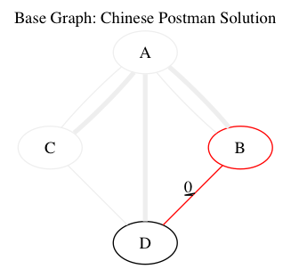
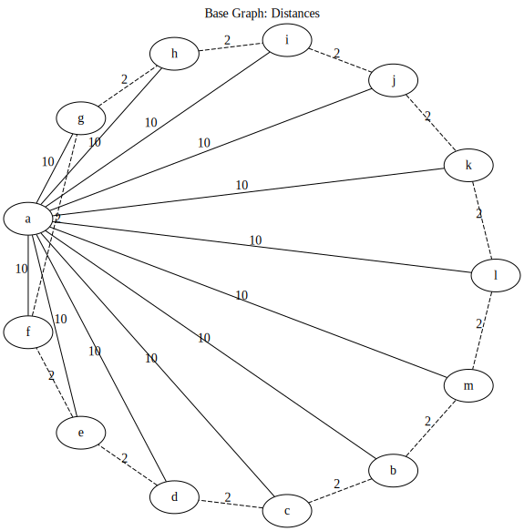
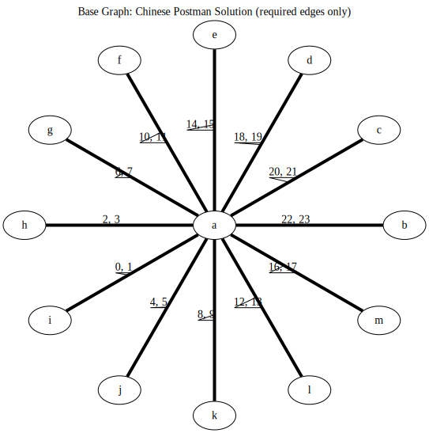
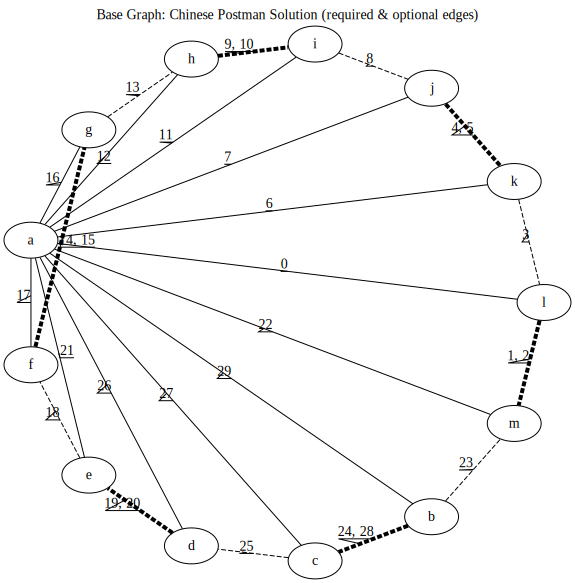
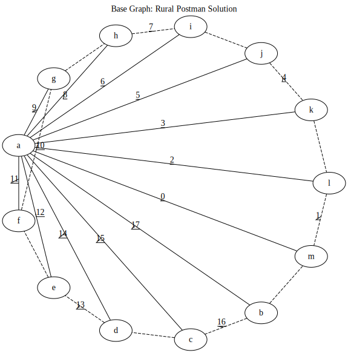
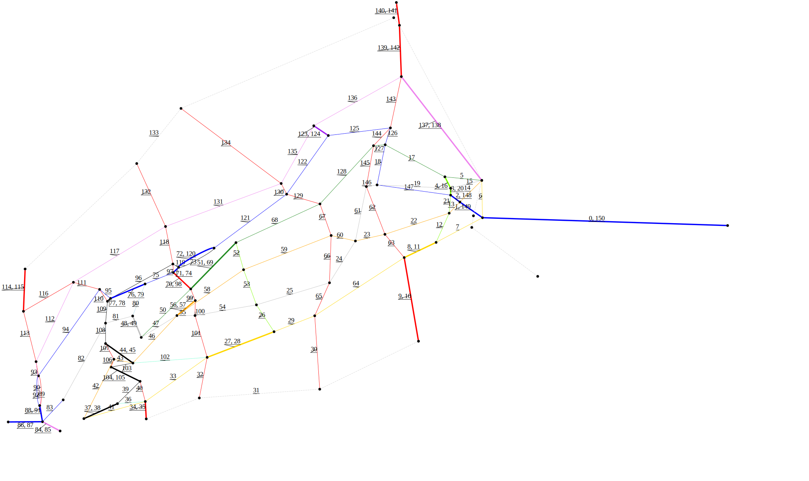

.. image:: https://travis-ci.org/brooksandrew/postman_problems.svg?branch=master
    :target: https://travis-ci.org/brooksandrew/postman_problems

.. image:: https://badge.fury.io/py/postman_problems.svg
    :target: https://badge.fury.io/py/postman_problems

.. image:: http://coveralls.io/repos/github/brooksandrew/postman_problems/badge.svg?branch=master
    :target: https://coveralls.io/github/brooksandrew/postman_problems?branch=master

.. image:: https://landscape.io/github/brooksandrew/postman_problems/master/landscape.svg?style=flat
   :target: https://landscape.io/github/brooksandrew/postman_problems/master
   :alt: Code Health

*Note to those reading this on PyPI: For a better reading experience, checkout the README on GitHub*
`here <https://github.com/brooksandrew/postman_problems/blob/master/README.rst>`__.  *GitHub and PyPI are not
cooperating on rendering SVGs*.

.. sectnum::

.. contents:: **Table of Contents:**
   :depth: 2

Contents
========

This package contains implementations to solve the suite of `Postman Problems`_ from graph theory.

Algorithms currently implemented:

- Chinese Postman
- Rural Postman (partial)

The Rural Postman implementation is currently restricted to a subset of problems.  Specifically to graphs where
the required edges form a single connected component when the optional edges are removed.

Install
=======

Basic
-----

**Option 1. Install from PyPI:** Stable release.

.. code:: bash

   pip install postman_problems

**Option 2. Install from GitHub:**  As this project develops, GitHub will have the most recent features, but no
guarantees they'll be stable.

1. Clone the repo.

   .. code::

      git clone https://github.com/brooksandrew/postman_problems.git
      cd postman_problems

2. Install with pip.  Builds are tested on Python 2.7, 3.3, 3.4, 3.5, 3.6.

   .. code::

      pip install .

Viz
---

``postman_problems`` leverages `Graphviz`_ for visualization which unlocks more robust visualizations than just NetworkX
and matplotlib.  However, this also comes with several dependencies.  These are managed separately from the
base package, so users can optimize graphs to their heart's content unencumbered from the weight and hassle of
installing viz dependencies, if they so choose.

1. Install optional Python visualization libraries.

   .. code::

      pip install postman_problems[viz]

2. Install Graphviz.  You need this underlying software application in addition to the `graphviz python package`_ which
   wraps around it.  Checkout the `Graphviz Download page`_ for the best way to install on your OS.

   For Mac, this should be as easy as:

   .. code::

      brew install graphviz

   For Linux,

   .. code::

      sudo apt-get install graphviz

   These are the installs I'm currently using on my builds for the `tests on TravisCI`_.  YMMV.  For Windows users and
   for those where these methods fail, I defer to the Graphviz download docs.

Usage
=====

CLI
---

The easiest way to start is with the command line using the entry points installed with this package: `chinese_postman`
and `rural_postman`.

Arguments: edgelist
~~~~~~~~~~~~~~~~~~~

There are several optional command line arguments, but the only one required is ``--edgelist``:

**Description:** Filename of edgelist.  Expected to be comma delimited text file readable with pandas.read_csv.  The first two columns
should be the "from" and "to" node names.  Additional columns can be provided for edge attributes.  The first row
should be the edge attribute names.

A note on some edge attributes:

- ``required``: must be provided for the RPP.  0 is used for optional edges, 1 for required.
- ``distance``: default edge attribute used for shortest path computations.  Can be overridden with ``edge_weight``.
- ``id``: recommended to not include, but will be used if provided.  This will be generated automatically to assist with
  computation of parallel edges.  If provided, it should be unique to ensure stable computation.

Arguments: others
~~~~~~~~~~~~~~~~~

For the complete list of optional arguments run one of the following:

.. code::

   chinese_postman --help
   rural_postman --help

The big ones are ``--viz`` and ``--animation``, which when present will create the static (single visualization) and
animation of the postman problem solution.  Most of the other arguments modify the default values used for the
visualizations.

Simple example
~~~~~~~~~~~~~~

Below we solve the CPP on the `Seven Bridges of Konigsberg`_ network.  The edgelist is provided in this repo, but you
can swap this out for any comma delimited text file where the first two columns represent the node pairs in your network.

.. code::

   chinese_postman --edgelist postman_problems/examples/seven_bridges/edgelist_seven_bridges.csv

If the ``chinese_postman`` entry point is not working for whatever reason, you can run the script directly with:

.. code::

   python postman_problems/chinese_postman.py --edgelist postman_problems/examples/seven_bridges/edgelist_seven_bridges.csv

You should see output that describes the CPP route solution (Eulerian circuit through each edge).  Something like this:

.. code ::

        ('A', 'C', 1, {'trail': 'd', 'distance': 10, 'id': 3})
        ('C', 'D', 0, {'trail': 'g', 'distance': 3, 'id': 6, 'augmented': True})
        ('D', 'C', 0, {'trail': 'g', 'distance': 3, 'id': 6})
        ('C', 'A', 0, {'trail': 'c', 'distance': 2, 'id': 2})
        ('A', 'D', 0, {'trail': 'e', 'distance': 1, 'id': 4})
        ('D', 'B', 0, {'trail': 'f', 'distance': 9, 'id': 5})
        ('B', 'A', 0, {'trail': 'a', 'distance': 3, 'id': 0, 'augmented': True})
        ('A', 'B', 1, {'trail': 'b', 'distance': 5, 'id': 1})
        ('B', 'A', 0, {'trail': 'a', 'distance': 3, 'id': 0})

The first two values of each tuple are the "from" and the "to" node respectively for each edge in the circuit.

The third value indicates the key of the edge on the MultiGraph.  These will be 0 unless there are parallel edges.

The fourth value contains the edge attributes for each edge walked.  These are mostly grabbed from the starting graph,
with two exceptions:

- ``augmented`` is added to edges after their first walk (double backing... the thing we want to minimize)
- ``id`` is generated to aid computation in the case of parallel edges.  This can generally be ignored.

A summary report of the solution should be printed.  Something like this:

.. code ::

    Solution summary stats:
    distance_walked : 39
    distance_doublebacked : 6
    distance_walked_once : 33
    distance_walked_optional : 0
    distance_walked_required : 39
    edges_walked : 9
    edges_doublebacked : 2
    edges_walked_once : 7
    edges_walked_optional : 0
    edges_walked_required : 9

Python
------

The postman solvers are modules that can also be imported and run within a Python environment.  This might interest you
if solving the CPP/RPP is just one step in your problem, you'd like to poke and prod at the output, or you'd like to tweak
the visualization or optimization parameters beyond what's provided from the CLI.

The snippet below should produce exactly the same output as printed above in `CLI`_.

.. code:: python

   from postman_problems.solver import cpp
   from postman_problems.stats import calculate_postman_solution_stats

   # find CPP solution
   circuit, graph = cpp(edgelist_filename='postman_problems/examples/seven_bridges/edgelist_seven_bridges.csv', start_node='D')

   # print solution route
   for e in circuit:
       print(e)

   # print solution summary stats
   for k, v in calculate_postman_solution_stats(circuit).items():
       print(k, v)

Examples
========

Three examples are included in ``postman_problems`` which demonstrate end-to-end usage: raw edgelist & nodelist =>
optimization and visualization.

Examples are added as entry points and pre-configured arguments, so they can be executed with the single commands below.

Note, the visualization step will write a GIF and a series of PNGs to your filesystem.  The paths are locked into
*postman_problems/examples/[example_name]/output/*.

An expected exception will be thrown if you don't have the visualization dependencies.  But no worries,
the output is prepackaged into ``/examples`` and images are embedded below.

Each example will produce the following file types:

- ``cpp_graph``: representation of ``cpp_graph.svg`` in the `DOT`_ graph description language.  This is provided mostly
  for reference, or for tweaking.
- ``cpp_graph.svg``: static image with edge attributes annotating the walk sequence.
- ``cpp_graph.gif``: animation highlighting each edge in the Euler circuit (solution route) as it's walked.
- ``png/img*.png``: PNGs generated for each frame of the GIF (omitted from package, but will hit your filesystem when
  you run the examples).

CPP: Seven Bridges of Konigsberg
--------------------------------

The Seven Bridges of Konigsberg is rather simple network with just 4 nodes and 7 edges.  Although small, it does contain
2 parallel edges which introduce some complexity to the CPP computation.

This was the graph with which Leonhard Euler famously postulated in 1736 that there exists a path which visits each edge
exactly once if all nodes have even degree. Although this wasn't proven until the 1870s by Carl Hierholzer, Euler was
right and this property is a key part of solving the Postman Problems.

This contrived example has been bundled and parameterized into a script that can be run with:

.. code::

   chinese_postman_seven_bridges

The example can also be run using the verbose method below which allows you to parameterize more pieces.
Many of the options provided below are defaults and can be excluded in practice. They are included here simply to convey
what the possibilities are:

.. code::

    chinese_postman --edgelist postman_problems/examples/seven_bridges/edgelist_seven_bridges.csv \
    --viz \
    --viz_filename 'postman_problems/examples/seven_bridges/output/cpp_graph.svg' \
    --viz_engine 'dot' \
    --animation \
    --animation_filename 'postman_problems/examples/seven_bridges/output/cpp_graph.gif' \
    --animation_images_dir 'postman_problems/examples/seven_bridges/output/img' \
    --animation_engine 'dot' \
    --animation_format 'png' \
    --fps 2

``base_cpp_graph.svg``: This is the starting graph.  Edges are annotated by distance.

.. image:: ./postman_problems/examples/seven_bridges/output/base_cpp_graph.svg

``cpp_graph.svg``: Edges are annotated with the order in which they are walked, starting at 0.  Edges walked more than
once are annotated by a sequence of numbers (walk order) and **bolded**.

.. image:: ./postman_problems/examples/seven_bridges/output/cpp_graph.svg

``cpp_graph.gif``: The nodes and edges in red indicate the current direction.

``cpp_graph``: dot representation of the graph is also provided.  This is mostly for reference, but in rare cases you may
want to tweak graphviz parameters directly here.

.. code ::

    graph {
	graph [forcelabels=true "strict"=false]
	C [label=C]
	D [label=D]
	A [label=A]
	B [label=B]
		C -- D [label=9 decorate=true distance=3 id=6 penwidth=1 trail=g]
		C -- A [label="6, 8" augmented=True decorate=true distance=2 id=2 penwidth=4 trail=c]
		C -- A [label=7 decorate=true distance=10 id=3 penwidth=1 trail=d]
		D -- A [label="0, 3" augmented=True decorate=true distance=1 id=4 penwidth=4 trail=e]
		D -- B [label=4 decorate=true distance=9 id=5 penwidth=1 trail=f]
		A -- B [label="2, 5" augmented=True decorate=true distance=3 id=0 penwidth=4 trail=a]
		A -- B [label=1 decorate=true distance=5 id=1 penwidth=1 trail=b]
    }

RPP: Star
---------

This is a simple example that demonstrates the power of the RPP vs CPP.

Run with:

.. code::

    rural_postman_star

``base_rpp_graph.svg``: Required edges are solid. Optional edges are dotted.  Simply showing the edge distances here.

``cpp_graph_req.svg``: If we solve this with the CPP and only only consider the required edges, we get the pretty inefficient solution below
doubling back on every single edge.

``cpp_graph_opt.svg``: If we recognize the optional edges, and apply the the CPP again (where the optional edges are treated
as required edges), we get a slightly better solution:

``rpp_graph.svg``: When we recognize the optional edges as truly optional and employ the RPP, we get the optimal solution
where we walk all required edges exactly once and only use a subset of optional edges:

``rpp_graph.gif``: Same information as above, but in an animation... because flashy moving pictures are fun.

.. image:: https://gist.githubusercontent.com/brooksandrew/d24560e674fccd1ab78f9d2588769e86/raw/4e477121ea698431ce294c6e1b17ad7e415eb396/rpp_star_example_for_postman_problems.gif

RPP: Sleeping Giant
-------------------

This example is near and dear to my heart and the motivation for this project in the first place.

`Sleeping Giant`_ is a state park near my hometown in Hamden CT with a little challenge called the `Giant Master Program`_.
Those who hike every trail (see `trail map`_) are awarded the honor of Giantmaster Marathoner and earn themselves a
spot on the `Giantmaster roster`_ and the glory of a red highlight on their name.

That's all I'll say here.  I wrote more about the personal motivation and Sleeping Giant specific data/problem in a
`DataCamp tutorial`_ which also helped motivate this project.

Run this example with:

.. code::

   rural_postman_sleeping_giant

``postman_problems/examples/sleeping_giant/rpp_graph.svg``:

The optional edges are marked with a dotted line.  You'll notice that not all of them are utilized (no edge label
annotating their order in the route).

``postman_problems/examples/sleeping_giant/rpp_graph.gif`` (omitted from package due to size):  Can be viewed
`here <https://gist.github.com/brooksandrew/64bacaff6d3004e3601ec14c41382fc3>`__.

Here are the solution summary stats.

.. code ::

    RPP Solution summary stats:

    Solution summary stats:
    distance_walked : 32.119999999999976
    distance_doublebacked : 6.11
    distance_walked_once : 26.009999999999977
    distance_walked_optional : 0.68
    distance_walked_required : 31.439999999999976
    edges_walked : 151
    edges_doublebacked : 30
    edges_walked_once : 121
    edges_walked_optional : 2
    edges_walked_required : 149

A CPP example is also provided with entry point ``chinese_postman_sleeping_giant``.  The solution is very similar,
so it is omitted here.

For a base of comparison on RPP vs CPP, selected stats are printed below for the CPP.  the RPP shortens the CPP solution
route by about 1 mile.

.. code ::

    CPP Solution summary stats:

    distance_walked : 33.24999999999998
    distance_doublebacked : 7.240000000000001
    distance_walked_once : 26.009999999999977
    edges_walked : 155
    edges_doublebacked : 34
    edges_walked_once : 121

Developers
==========

If you'd like to fork or contribute directly to this project (PRs welcome), or simply want run the tests, here's how:

0. Clone/Fork repo

1. Full install with test and viz dependencies.

   .. code::

       pip install .[test,viz]

   Or do an editable install from the beginning.  This is my typical approach when developing.

   .. code::

       pip install -e .[test,viz]

2. Run tests

   .. code::

       python -m pytest
       pytest --cov

   Some tests take quite a while to run.  Namely the examples that write visualizations to the filesystem for large networks.

   As I have limited patience while developing, but am too cautious to drop them completely, I've kept and marked them with the ``@slow`` and ``@long`` decorators.  ``conftest.py`` is configured to exclude them by default with a simple run of ``pytest`` or ``python -m pytest``, but the full test suite can be run by:

   .. code::

       python -m pytest --runslow
       pytest --cov --runslow

Release Notes
=============

Checkout the release notes in Gitub `here <https://github.com/brooksandrew/postman_problems/releases>`__.

If I'm doing a good job of keeping PyPI updated, each release should also be available
`here <https://pypi.org/project/postman_problems/#history>`__.

License
=======

Released under the MIT License (see `LICENSE.txt`_).

Copyright (C) 2017 Andrew Brooks.

.. _`Postman Problems`: https://en.wikipedia.org/wiki/Route_inspection_problem
.. _`Seven Bridges of Konigsberg`: https://en.wikipedia.org/wiki/Seven_Bridges_of_K%C3%B6nigsberg
.. _`Graphviz python package`: https://pypi.python.org/pypi/graphviz
.. _`Graphviz Download page`: http://www.graphviz.org/Download..php
.. _`Graphviz`: http://www.graphviz.org/
.. _`Tests on TravisCI`: https://github.com/brooksandrew/postman_problems/blob/master/.travis.yml
.. _`Sleeping Giant`: http://www.sgpa.org/
.. _`Giant Master Program`: http://www.sgpa.org/hikes/masters.html
.. _`trail map`: http://www.ct.gov/deep/lib/deep/stateparks/maps/sleepgiant.pdf
.. _`Giantmaster roster`: http://www.sgpa.org/hikes/master-list.htm
.. _`Datacamp tutorial`: https://www.datacamp.com/community/tutorials/networkx-python-graph-tutorial
.. _`DOT`: https://en.wikipedia.org/wiki/DOT_(graph_description_language)
.. _`LICENSE.txt`: https://github.com/brooksandrew/postman_problems/blob/master/LICENSE.txt
